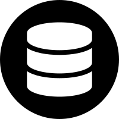

Database
========

Aplus Framework Database Library.

- `Installation`_
- `Introduction`_
- `Basic Usage`_
- `Connection`_
- `Executing Queries`_
- `Prepared Statement`_
- `Result`_
- `Data Manipulation Language - DML`_
- `SELECT`_
- `INSERT`_
- `UPDATE`_
- `DELETE`_
- `REPLACE`_
- `WITH`_
- `LOAD DATA`_
- `Data Definition Language - DDL`_
- `CREATE SCHEMA`_
- `ALTER SCHEMA`_
- `DROP SCHEMA`_
- `CREATE TABLE`_
- `ALTER TABLE`_
- `DROP TABLE`_
- `Conclusion`_

Installation
------------

The installation of this library can be done with Composer:

.. code-block::

    composer require aplus/database

Introduction
------------

The Database library is designed to work with MariaDB and MySQL databases.

Basic Usage
-----------

The use of the entire library is centered on the Database class. In it, the
connection with the database is made and the desired queries are mounted.

Connection
##########

The connection with the database server can be done in the Database class
construction. You can use all parameters:

.. code-block:: php

    use Framework\Database\Database;

    $database = new Database($username, $password, $schema, $host, $port, $logger);

Or, pass the configurations as an array in the first parameter:

.. code-block:: php

    use Framework\Database\Database;

    $database = new Database($config);

Below is the default class configuration. Normally, only the ``username``, the
``password`` and the ``schema`` are changed.

.. code-block:: php

    $default = [
        'host' => 'localhost',
        'port' => 3306,
        'username' => null,
        'password' => null,
        'schema' => null,
        'socket' => null,
        'persistent' => false,
        'engine' => 'InnoDB',
        'charset' => 'utf8mb4',
        'collation' => 'utf8mb4_general_ci',
        'timezone' => '+00:00',
        'ssl' => [
            'enabled' => false,
            'verify' => true,
            'key' => null,
            'cert' => null,
            'ca' => null,
            'capath' => null,
            'cipher' => null,
        ],
        'failover' => [],
        'options' => [
            MYSQLI_OPT_CONNECT_TIMEOUT => 10,
            MYSQLI_OPT_INT_AND_FLOAT_NATIVE => true,
            MYSQLI_OPT_LOCAL_INFILE => 1,
        ],
        'report' => MYSQLI_REPORT_ALL & ~MYSQLI_REPORT_INDEX,
    ];

Executing Queries
#################

You can read data via the `query`_ method and write via the `exec`_ method.

query
^^^^^

To query data obtaining a result, use the ``query`` method.

It will always return a `Result`_ instance, from which the query result rows
can be read.

.. code-block:: php

    $result = $database->query('SELECT * FROM Users WHERE id = 1'); // Result

Whenever you need to use dynamic data in the query, use the ``quote`` method to
sanitize values in order to avoid SQL Injection:

.. code-block:: php

    $id = $database->quote($_GET['user_id']);
    $result = $database->query('SELECT * FROM Users WHERE id = ' . $id); // Result

exec
^^^^

With the ``exec`` method, the writing to the database is performed. And the return
is always a number, being the number of affected rows.

.. code-block:: php

    $affectedRows = $database->exec('INSERT INTO Users SET name = "John Doe"'); // int

Again, always use the ``quote`` method if you need to get dynamic data to build
the SQL statement:

.. code-block:: php

    $name = $database->quote($_POST['name']);
    $affectedRows = $database->exec('INSERT INTO Users SET name = ' $name); // int

Prepared Statement
##################

To avoid having to quote data insuring against SQL Injection, you can use
Prepared Statements.

In the prepared statement the values are replaced by a question mark and when
executed returns an instance of the **PreparedStatement** class:

.. code-block:: php

    $preparedStatement = $database->prepare('SELECT * FROM Users WHERE id = ?'); // PreparedStatement

With the PreparedStatement instance, the ``query`` method is called for queries,
passing in the parameters the values used in place of the question marks:

.. code-block:: php

    $result = $database->prepare('SELECT * FROM Users WHERE id = ?')->query(5); // Result

Another example querying with data that could be dynamic:

.. code-block:: php

    $idGreaterThan = 3;
    $nameLike = 'John %';
    $result = $database->prepare('SELECT * FROM Users WHERE id > ? AND name LIKE ?')
                       ->query($idGreaterThan, $nameLike); // Result

And, to perform writings, use the ``exec`` method of the PreparedStatement
class, passing the values in order in the same way as in the ``query`` method:

.. code-block:: php

    $affectedRows = $database->prepare('INSERT INTO Users SET name = ?')
                             ->exec($_POST['name']); // int

Result
######

The ``query`` method of the Database class will always return an instance of the
Result class.

With it it is possible to fetch the results in the form of arrays or objects.
Let's see:

.. code-block:: php

    $result = $database->query('SELECT * FROM Users'); // Result
    $first = $result->fetch(); // object or null
    $others = $result->fetchAll(); // array of objects or empty array
    $userOnRow10 = $result->fetchRow(10); // object or null

Data Manipulation Language - DML
--------------------------------

To manipulate tables in a database schema we can use the various methods of the
Database class. Since they have a fluent interface and with automatic identifier
and quote protection.

The DML statements are these:

- `SELECT`_
- `INSERT`_
- `UPDATE`_
- `DELETE`_
- `REPLACE`_
- `WITH`_
- `LOAD DATA`_

SELECT
######

SELECT lets you select rows from one or more tables.

Below we see an example setting up the query and calling the ``run`` method,
which will get a Result:

.. code-block:: php

    $result = $database->select()
                       ->from('Users')
                       ->where('id', '<', 5)
                       ->run(); // Result

    // HTML table rows with users data
    while($user = $result->fetch()) {
        echo '<tr>';
        echo '<td>' . $user->id . '</td>';
        echo '<td>' . htmlentities($user->name) . '</td>';
        echo '</tr>';
    }

Dynamic fields are automatically quoted. Here's an example getting the ``user_id``
from the global variable ``$_GET``:

.. code-block:: php

    $sql = $database->select()
                    ->from('Users')
                    ->where('id', '<', $_GET['user_id'])
                    ->sql(); // string

Notice that the value is quoted when using the ``sql`` method to build the
statement:

.. code-block:: sql

    SELECT
     *
     FROM `Users`
     WHERE `id` < '5;drop table Users;'

INSERT
######

INSERT is for inserting new rows into a table.

You can insert a row only using the SET clause:

.. code-block:: php

    $affectedRows = $database->insert()
                             ->into('Users')
                             ->set([
                                'name' => 'John',
                                'email' => 'foo@baz.com',
                             ])->run();

.. code-block:: sql

    INSERT
     INTO `Users`
     SET `name` = 'John', `email` = 'foo@baz.com'

Or several at once using the ``columns`` and ``values`` methods:

.. code-block:: php

    $affectedRows = $database->insert()
                             ->into('Users')
                             ->columns('name', 'email')
                             ->values([
                                 ['John', 'foo@baz.com'],
                                 ['Mary', 'bar@baz.com'],
                             ])->run();

SQL executed:

.. code-block:: sql

    INSERT
     INTO `Users`
     (`name`, `email`)
     VALUES ('John', 'foo@baz.com'),
     ('Mary', 'bar@baz.com')

Insert ID
^^^^^^^^^

Whenever a new row is inserted in an auto-increment table, it is possible to
obtain the id of the inserted row through the ``insertId`` method of the
Database class.

.. code-block:: php

    $id = $database->insertId();

When several rows are inserted in the same statement, the id returned is that of
the first inserted row.

UPDATE
######

Through the UPDATE statement, update values in table columns.

Let's see an example updating the Users table, setting a new name where the id
is equal to one.

.. code-block:: php

    $affectedRows = $database->update()
                             ->table('Users')
                             ->set(['name' => 'Johnny']);
                             ->whereEqual('id', 1)
                             ->run();

The SQL statement executed above is the same as below:

.. code-block:: sql

    UPDATE
     `Users`
     SET `name` = 'Johnny'
     WHERE `id` = 1

DELETE
######

DELETE is for deleting rows in tables.

See the example below of how to delete rows in the Users table, where the id is
equal to 88:

.. code-block:: php

    $affectedRows = $database->delete()
                             ->from('Users')
                             ->whereEqual('id', 88)
                             ->run();

The example above builds and executes the following SQL statement:

.. code-block:: sql

    DELETE
     FROM `Users`
     WHERE `id` = 88

REPLACE
#######

REPLACE works in the same way as `INSERT`_, except that if an old row has the
same primary or unique key, the old row will be deleted and then the new row
will be inserted.

Let's see an example replacing a row in the Users table:

.. code-block:: php

    $affectedRows = $database->replace()
                             ->into('Users')
                             ->columns('id', 'name', 'email')
                             ->values(1, 'John Doe', 'johndoe@ecorp.tld')
                             ->run();

The SQL statement below is the one executed in the example above:

.. code-block:: sql

    REPLACE
     INTO `Users`
     (`id`, `name`, `email`)
     VALUES (1, 'John Doe', 'johndoe@ecorp.tld')

WITH
####

WITH allows you to refer to a subquery expression many times in a query, as if
having a temporary table that only exists for the duration of a query.

.. code-block:: php

    $result = $database->with()->reference('t', function (Select $select) {
        return $select->expressions('a')
            ->from('t1')
            ->whereGreaterThanOrEqual('b', 'c')
            ->sql();
    })->select(function (Select $select) {
        return $select->from('t2', 't')
            ->whereEqual(
                't2.c',
                fn (Database $db) => $db->protectIdentifier('t.a')
            )->sql();
    })->run();

The code above will build and execute the following statement:

.. code-block:: sql

    WITH
    `t` AS (SELECT
     `a`
     FROM `t1`
     WHERE `b` >= 'c'
    )
    SELECT
     *
     FROM `t2`, `t`
     WHERE `t2`.`c` = (`t`.`a`)

LOAD DATA
#########

LOAD DATA INFILE is able to read files and insert their data into a table.

Let's see an example below:

.. code-block:: php

    use Framework\Database\Manipulation\LoadData;

    $database->loadData()
             ->infile('/home/developer/users.csv')
             ->options(LoadData::OPT_LOCAL)
             ->intoTable('Users')
             ->charset('utf8')
             ->columnsTerminatedBy(',')
             ->run();

Will run the following statement:

.. code-block:: sql

    LOAD DATA
    LOCAL
     INFILE '/home/developer/users.csv'
     INTO TABLE `Users`
     CHARACTER SET utf8
     COLUMNS
      TERMINATED BY ','

For this statement to work, the ``mysqli.allow_local_infile`` directive must be
``On`` in the **php.ini** file.

Data Definition Language - DDL
------------------------------

Through the DDL, the structure of a database is defined, with the definition of
schemas and tables.

Statements for defining schemas:

- `CREATE SCHEMA`_
- `ALTER SCHEMA`_
- `DROP SCHEMA`_

Statements for defining tables:

- `CREATE TABLE`_
- `ALTER TABLE`_
- `DROP TABLE`_

CREATE SCHEMA
#############

CREATE SCHEMA creates database schemas with a specific name.

Let's look at an example creating the ``app`` schema:

.. code-block:: php

    $database->createSchema('app')->run();

The statement executed above is the same as the example below:

.. code-block:: sql

    CREATE SCHEMA `app`

ALTER SCHEMA
############

ALTER SCHEMA makes it possible to change characteristics of a database schema.

Let's see, in the example below, how to change the charset of the app schema:

.. code-block:: php

    $database->alterSchema('app')->charset('utf8')->run();

.. code-block:: sql

    ALTER SCHEMA `app`
     CHARACTER SET = 'utf8'

DROP SCHEMA
###########

DROP SCHEMA drops all tables and drops the database schema.

Let's see how to remove the app schema:

.. code-block:: php

    $database->dropSchema('app')->run();

.. code-block:: sql

    DROP SCHEMA `app`

CREATE TABLE
############

CREATE TABLE is used to create tables within schemas.

Let's see in the example below how to create a table called Users, adding
columns and indexes in it:

.. code-block:: php

    use Framework\Database\Definition\Table\TableDefinition;

    $database->createTable('Users')
             ->definition(function (TableDefinition $def) {
                $def->column('id')->int(11)->primaryKey();
                $def->column('email')->varchar(255);
                $def->column('name')->varchar(32)->null();
                $def->column('type')
                    ->enum('basic', 'premium')
                    ->default('basic')
                    ->comment('User type used in the authorization system');
                $def->index()->uniqueKey('email');
            })->run();

The PHP example above will build and execute the following SQL:

.. code-block:: sql

    CREATE TABLE `Users` (
      `id` int(11) NOT NULL PRIMARY KEY,
      `email` varchar(255) NOT NULL,
      `name` varchar(32) NULL,
      `type` enum('basic', 'premium') NOT NULL DEFAULT 'basic' COMMENT 'User type used in the authorization system',
      UNIQUE KEY (`email`)
    )

ALTER TABLE
###########

ALTER TABLE allows you to change the structure of a table, such as adding or
removing columns and indexes.

Let's look at an example adding the ``configs`` and ``birthday`` columns to the
Users table:

.. code-block:: php

    use Framework\Database\Definition\Table\TableDefinition;

    $database->alterTable('Users')
             ->add(function (TableDefinition $def) {
                $def->column('configs')->json()->default('{}');
                $def->column('birthday')->date()->null()->after('name');
             })->run();

The code above will build and execute the following statement:

.. code-block:: sql

    ALTER TABLE `Users`
      ADD COLUMN `configs` json NOT NULL DEFAULT '{}',
      ADD COLUMN `birthday` date NULL AFTER `name`

DROP TABLE
##########

DROP TABLE removes one or more tables from a database schema:

.. code-block:: php

    $database->dropTable('Users')->run();

.. code-block:: sql

    DROP TABLE `Users`

Conclusion
----------

Aplus Database Library is an easy-to-use tool for, beginners and experienced, PHP developers. 
It is perfect for manipulating and defining databases quickly and securely. 
The more you use it, the more you will learn.

.. note::
    Did you find something wrong? 
    Be sure to let us know about it with an
    `issue <https://github.com/aplus-framework/database/issues>`_. 
    Thank you!

